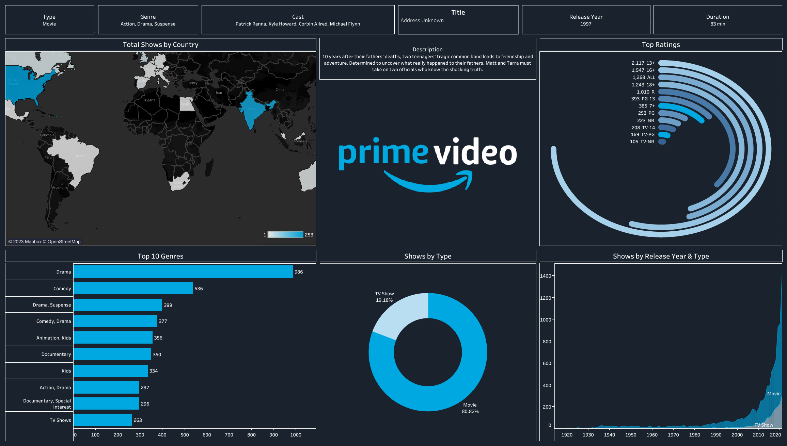

# 📊 Prime Video Content Analysis Dashboard

This repository presents an interactive data visualization dashboard analyzing the content catalog of **Amazon Prime Video**. The dashboard is designed to uncover patterns in genre distribution, country-level availability, ratings, and content evolution over time.

## 🔍 Dashboard Overview

### 📌 Key Visual Components:

- **Type Breakdown**: Distinguishes between movies and TV shows.
- **Genre Analysis**: Shows the top 10 most common genres.
- **Cast, Title, Year, Duration**: Detailed metadata for individual titles.
- **Country Distribution**: Choropleth map showing the number of titles available by country.
- **Ratings Analysis**: Visualization of the most common content ratings.
- **Release Trend**: Timeline of content releases segmented by type.
- **Description Panel**: Showcases sample content storyline or synopsis.

## 📊 Insights Derived

- **Most Common Genre**: Drama leads with 986 titles.
- **Primary Content Type**: ~81% of the catalog consists of movies.
- **Top Country**: India appears to have the highest number of available titles (253+).
- **Popular Ratings**: '13+', '16+', and 'ALL' are the most frequently used content ratings.

## 🛠️ Tools & Technologies

- **Data Visualization**: Tableau
- **Data Source**: Publicly available datasets or Prime Video catalog metadata
- **Image Format**: PNG snapshot of the Tableau dashboard

## 📂 Files

- `Snapshot.png`: The exported dashboard image.
- `README.md`: Documentation of the project.

## 📈 Future Enhancements

- Interactive web-based dashboard (Tableau Public / Power BI Embedded)
- Addition of filters for actor, director, or language
- Analysis of viewer trends and user ratings

### 📬 Contact

For questions or collaboration, feel free to reach out via GitHub Issues or open a pull request.

